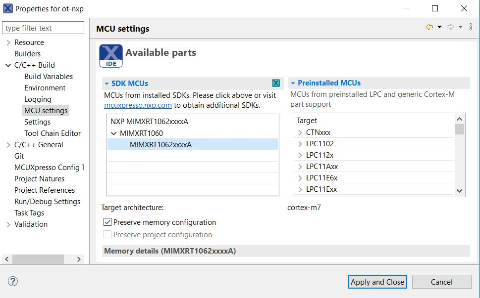

# OpenThread on NXP RT1060 (host) + K32W061 (rcp) Example

This directory contains example platform drivers for the [NXP RT1060][rt1060] platform.

The example platform drivers are intended to present the minimal code necessary to support OpenThread. As a result, the example platform drivers do not necessarily highlight the platform's full capabilities.

[rt1060]: https://www.nxp.com/products/processors-and-microcontrollers/arm-microcontrollers/i-mx-rt-crossover-mcus/i-mx-rt1060-crossover-mcu-with-arm-cortex-m7-core:i.MX-RT1060

## Prerequisites

Before you start building the examples, you must download and install the toolchain and the tools required for flashing and debugging.

## Toolchain

OpenThread environment is suited to be run on a Linux-based OS.

In a Bash terminal (found, for example, in Ubuntu OS), follow these instructions to install the GNU toolchain and other dependencies.

```bash
$ cd <path-to-ot-nxp>
$ ./script/bootstrap
```

## Tools

- Download and install the [MCUXpresso IDE][mcuxpresso ide].

[mcuxpresso ide]: https://www.nxp.com/support/developer-resources/software-development-tools/mcuxpresso-software-and-tools/mcuxpresso-integrated-development-environment-ide:MCUXpresso-IDE

- Download [IMXRT1060 SDK 2.10.0](https://mcuxpresso.nxp.com/).
  Creating an nxp.com account is required before being able to download the
  SDK. Once the account is created, login and follow the steps for downloading
  SDK_2.10.0_EVK-MIMXRT1060. In the SDK Builder UI selection you should select
  the FreeRTOS and the BT/BLE component.

## Building the examples

```bash
$ cd <path-to-ot-nxp>
$ export NXP_RT1060_SDK_ROOT=/path/to/previously/downloaded/SDK
$ ./script/build_rt1060
```

After a successful build, the ot-cli-rt1060 FreeRTOS version could be found in `build_rt1060` and include FTD (Full Thread Device).

Note: FreeRTOS is required to be able to build the IMXRT1060 platform files.

## Hardware requirements

Host part:

- 1 EVK-MIMXRT1060

Transceiver part:

- 1 OM15076-3 Carrier Board (DK6 board)
- 1 K32W061 Module to be plugged on the Carrier Board

## Board settings

The below table explains pin settings (UART settings) to connect the evkmimxrt1060 (host) to a k32w061 transceiver (rcp).

| PIN NAME | DK6 (K32W061) | I.MXRT1060 | PIN NAME OF RT1060 | GPIO NAME OF RT1060 |
| :------: | :-----------: | :--------: | :----------------: | :-----------------: |
| UART_TXD |  PIO, pin 8   | J22, pin 1 |    LPUART3_RXD     |    GPIO_AD_B1_07    |
| UART_RXD |  PIO, pin 9   | J22, pin 2 |    LPUART3_TXD     |    GPIO_AD_B1_06    |
| UART_RTS |  PIO, pin 6   | J23, pin 3 |    LPUART3_CTS     |    GPIO_AD_B1_04    |
| UART_CTS |  PIO, pin 7   | J23, pin 4 |    LPUART3_RTS     |    GPIO_AD_B1_05    |

The below picture shows pins connections.


Note: it is recommended to first [flash the K32W061 OT-RCP transceiver image](#Flashing-the-K32W061-OT-RCP-transceiver-image) before connecting the DK6 to the IMXRT1060.

## Flash Binaries

### Flashing the K32W061 OT-RCP transceiver image

Connect to the DK6 board by plugging a mini-USB cable to the connector marked with _FTDI USB_. Also, make sure that jumpers jp4/JP7 are situated in the middle position (_JN UART0 - FTDI_).

DK6 Flash Programmer can be found inside the [SDK][sdk_mcux] SDK_2.10.0_EVK-MIMXRT1060 previously downloaded at path `<sdk_path>/middleware/wireless/ethermind/port/pal/mcux/bluetooth/controller/k32w061/JN-SW-4407-DK6-Flash-Programmer`. This is a Windows application that can be installed using the .exe file. Once the application is installed, the COM port for K32W061 must be identified:

```
C:\nxp\DK6ProductionFlashProgrammer>DK6Programmer.exe  --list
Available connections:
COM29
```

The ot-rcp image can be found in the SDK_2.10.0_EVK-MIMXRT1060 previously downloaded at path `<sdk_path>/middleware/wireless/ethermind/port/pal/mcux/bluetooth/controller/k32w061/ot_rcp.bin`.
Once the COM port is identified, the required binary can be flashed:

```
C:\nxp\DK6ProductionFlashProgrammer>DK6Programmer.exe -s COM29 -p "<sdk_path>/middleware/wireless/ethermind/port/pal/mcux/bluetooth/controller/k32w061/ot-rcp.bin"
```

[sdk_mcux]: https://mcuxpresso.nxp.com/en/welcome

### Flashing the IMXRT ot-cli-rt1060 host image using MCUXpresso IDE

In order to flash the application for debugging we recommend using [MCUXpresso IDE (version >= 11.3.1)](https://www.nxp.com/design/software/development-software/mcuxpresso-software-and-tools-/mcuxpresso-integrated-development-environment-ide:MCUXpresso-IDE?tab=Design_Tools_Tab).

- Import the previously downloaded NXP SDK into MCUXpresso IDE. This can be done by drag-and-dropping the SDK archive into MCUXpresso IDE.

- Import ot-nxp repo in MCUXpresso IDE as Makefile Project. Use _none_ as _Toolchain for Indexer Settings_:

```
File -> Import -> C/C++ -> Existing Code as Makefile Project
```

- Configure MCU Settings:

```
Right click on the Project -> Properties -> C/C++ Build -> MCU Settings -> Select MIMXRT1060 -> Apply & Close
```



- Configure the toolchain editor:

```
Right click on the Project -> C/C++ Build-> Tool Chain Editor -> NXP MCU Tools -> Apply & Close
```


- Create a debug configuration:

```
Right click on the Project -> Debug -> As->MCUXpresso IDE LinkServer (inc. CMSIS-DAP) probes -> OK -> Select elf file called ot-cli-rt1060
```

- Set the _Connect script_ for the debug configuration to _RT1060_connect.scp_ from the dropdown list:

```
Right click on the Project -> Debug As -> Debug configurations... -> LinkServer Debugger
```


- Set the _Initialization Commands_ to:

```
Right click on the Project -> Debug As -> Debug configurations... -> Startup

set non-stop on
set pagination off
set mi-async
set remotetimeout 60000
##target_extended_remote##
set mem inaccessible-by-default ${mem.access}
mon ondisconnect ${ondisconnect}
set arm force-mode thumb
${load}
```


- Disable auto build:

```
Right click on the Project -> Debug As -> Debug configurations... -> Main
```


- Debug using the newly created configuration file:


[cmsis-dap]: https://os.mbed.com/handbook/CMSIS-DAP

## Running the example

1. The CLI example uses UART connection. To view raw UART output, start a terminal emulator like PuTTY and connect to the used COM port with the following UART settings (on the IMXRT1060):

   - Baud rate: 115200
   - 8 data bits
   - 1 stop bit
   - No parity
   - No flow control

2. Open a terminal connection and start a new Thread network.

```bash
> panid 0xabcd
Done
> ifconfig up
Done
> thread start
Done
```

4. After a couple of seconds the node will become a Leader of the network.

```bash
> state
Leader
```

5. Open a terminal connection on another board (supporting the cli openthread) and attach a node to the network.

```bash
> panid 0xabcd
Done
> ifconfig up
Done
> thread start
Done
```

6. After a couple of seconds the second node will attach and become a Child.

```bash
> state
Child
```

7. List all IPv6 addresses of the first board.

```bash
> ipaddr
fdde:ad00:beef:0:0:ff:fe00:fc00
fdde:ad00:beef:0:0:ff:fe00:9c00
fdde:ad00:beef:0:4bcb:73a5:7c28:318e
fe80:0:0:0:5c91:c61:b67c:271c
```

8. Choose one of them and send an ICMPv6 ping from the second board.

```bash
> ping fdde:ad00:beef:0:0:ff:fe00:fc00
16 bytes from fdde:ad00:beef:0:0:ff:fe00:fc00: icmp_seq=1 hlim=64 time=8ms
```

For a list of all available commands, visit [OpenThread CLI Reference README.md][cli].

[cli]: https://github.com/openthread/openthread/blob/master/src/cli/README.md
