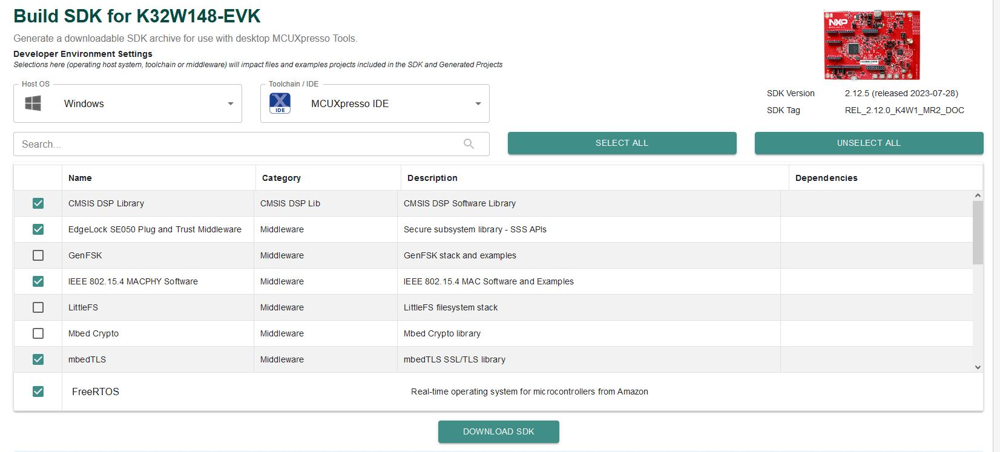
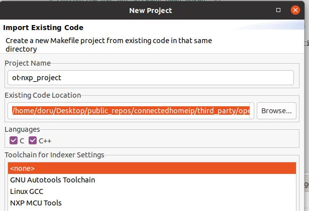
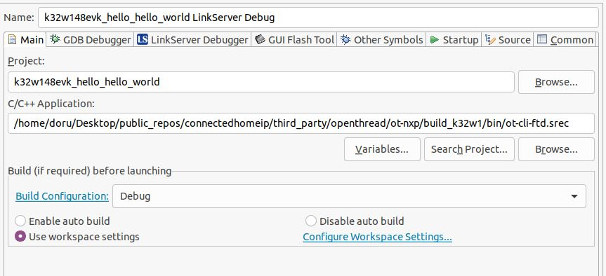

# OpenThread on NXP K32W1 Example

This directory contains example platform drivers for the [NXP K32W1][nxp_k32w1] based on K32W148-EVK hardware platform.

The example platform drivers are intended to present the minimal code necessary to support OpenThread. As a result, the example platform drivers do not necessarily highlight the platform's full capabilities.

[nxp_k32w1]: https://www.nxp.com/products/wireless/multiprotocol-mcus/tri-core-secure-and-ultra-low-power-mcu-for-matter-over-thread-and-bluetooth-le-5-3:K32W148

## Prerequisites

Before you start building the examples, you must download and install the toolchain and the tools required for flashing and debugging.

## Toolchain

OpenThread environment is suited to be run on a Linux-based OS.

In a Bash terminal (found, for example, in Ubuntu OS), follow these instructions to install the GNU toolchain and other dependencies.

```bash
$ cd <path-to-ot-nxp>
$ ./script/bootstrap
```

## Tools

- Download [the latest SDK from the link.](https://mcuxpresso.nxp.com/).
  Creating an nxp.com account is required before being able to download the
  SDK. Once the account is created, login and follow the steps for downloading
  SDK_2.12.0_K32W148-EVK. The SDK Builder UI selection should be similar with
  the one from the image below.
  

## Building the examples

```bash
$ cd <path-to-ot-nxp>
$ export NXP_K32W1_SDK_ROOT=/path/to/previously/downloaded/SDK
$ ./script/build_K32W1
```

After a successful build, the `elf` and `srec` files are found in `build_k32w1/bin` and include FTD (Full Thread Device) and MTD (Minimal Thread Device) variants of CLI applications.
NCP variants and also an RCP image is generated.

### Extracting the binaries from the elf files

In the same `bin` directory you can also find binaries in the form of `srec` files.

If needed, `elf` files can be converted to `srec` format using the command below:

```bash
$ arm-none-eabi-objcopy -O srec ot-cli-ftd ot-cli-ftd.srec
```

## Flashing

Two images must be written to the board: one for the host (CM33) and one for the NBU (CM3).

The image needed on the host side is the one generated in `build_k32w1/bin` while the one needed on the NBU side can be found in the downloaded NXP-SDK package at path - `middleware\wireless\ieee-802.15.4\bin\k32w1\k32w1_nbu_ble_15_4_dyn_a1.sb3`.

### Flashing the NBU image

NBU image should be written only when a new NXP-SDK is released. [blhost tool](https://cache.nxp.com/secured/assets/downloads/en/device-drivers/blhost_2.6.7.zip?fileExt=.zip) can be used for flashing. Before writing the image, please make sure that K32W1 is in bootloader mode by keeping the SW4 button pressed while connecting the K32W1 board to an USB port (unplug the board if already connected to an USB port):

```bash
C:\nxp\blhost_2.6.7> blhost.exe -p COM50 -- receive-sb-file .\k32w1_nbu_ble_15_4_dyn_a1.sb3
```

Please note that COM50 should be replaced with the COM port that corresponds to the K32W1 device.

### Flashing the host image

Host image is the one found under `build_k32w1/bin`. It should be written after each build process.

If debugging is needed then jump directly to the [Debugging](#debugging) section. Otherwise, if only flashing is needed then [JLink 7.84b](https://www.segger.com/downloads/jlink/) can be used:

- Plug K32W1 to the USB port (no need to keep the SW4 button pressed while doing this)

- Create a new file, `commands_script`, with the following content (change application name accordingly):

```bash
reset
halt
loadfile ot-cli-ftd.srec
reset
go
quit
```

- copy the application and `commands_script` in the same folder that JLink executable is placed. Execute:

```bash
$  jlink -device K32W1480 -if SWD -speed 4000 -autoconnect 1 -CommanderScript commands_script
```

<a name="#debugging"></a>

## Debugging

One option for debugging would be to use MCUXpresso IDE.

- Drag-and-drop the zip file containing the NXP SDK in the "Installed SDKs" tab:


- Import any demo application from the installed SDK:

```
Import SDK example(s).. -> choose a demo app (demo_apps -> hello_world) -> Finish
```


- Flash the previously imported demo application on the board:

```
Right click on the application (from Project Explorer) -> Debug as -> JLink/CMSIS-DAP
```

After this step, a debug configuration specific for the K32W1 board was created. This debug configuration will
be used later on for debugging the application resulted after ot-nxp compilation.

- Import OpenThread repo in MCUXpresso IDE as Makefile Project. Use _none_ as
  _Toolchain for Indexer Settings_:

```
File -> Import -> C/C++ -> Existing Code as Makefile Project
```



- Replace the path of the existing demo application with the path of the K32W1 application:

```
Run -> Debug Configurations... -> C/C++ Application
```



## Running the example

1. Prepare two boards with the flashed `CLI Example` (as shown above).
2. The CLI example uses UART connection. To view raw UART output, start a terminal emulator like PuTTY and connect to the used COM port with the following UART settings:

   - Baud rate: 115200
   - 8 data bits
   - 1 stop bit
   - No parity
   - No flow control

3. Open a terminal connection on the first board and start a new Thread network.

```bash
> panid 0xabcd
Done
> ifconfig up
Done
> thread start
Done
```

4. After a couple of seconds the node will become a Leader of the network.

```bash
> state
Leader
```

5. Open a terminal connection on the second board and attach a node to the network.

```bash
> panid 0xabcd
Done
> ifconfig up
Done
> thread start
Done
```

6. After a couple of seconds the second node will attach and become a Child.

```bash
> state
Child
```

7. List all IPv6 addresses of the first board.

```bash
> ipaddr
fdde:ad00:beef:0:0:ff:fe00:fc00
fdde:ad00:beef:0:0:ff:fe00:9c00
fdde:ad00:beef:0:4bcb:73a5:7c28:318e
fe80:0:0:0:5c91:c61:b67c:271c
```

8. Choose one of them and send an ICMPv6 ping from the second board.

```bash
> ping fdde:ad00:beef:0:0:ff:fe00:fc00
16 bytes from fdde:ad00:beef:0:0:ff:fe00:fc00: icmp_seq=1 hlim=64 time=8ms
```

For a list of all available commands, visit [OpenThread CLI Reference README.md][cli].

[cli]: https://github.com/openthread/openthread/blob/main/src/cli/README.md
